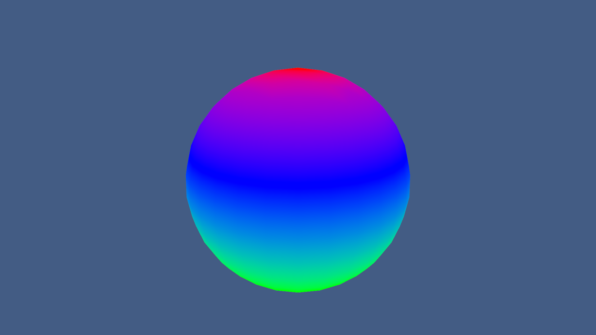

## UnlitGradient

Unlit Unity built-in render pipeline shader, which demonstrates how to create a gradient shader.

The color count is fixed, but it's possible to extend this kind of shader to be more flexible.

I created this as a template for myself, so that I can remember how to make this kind of effect.

